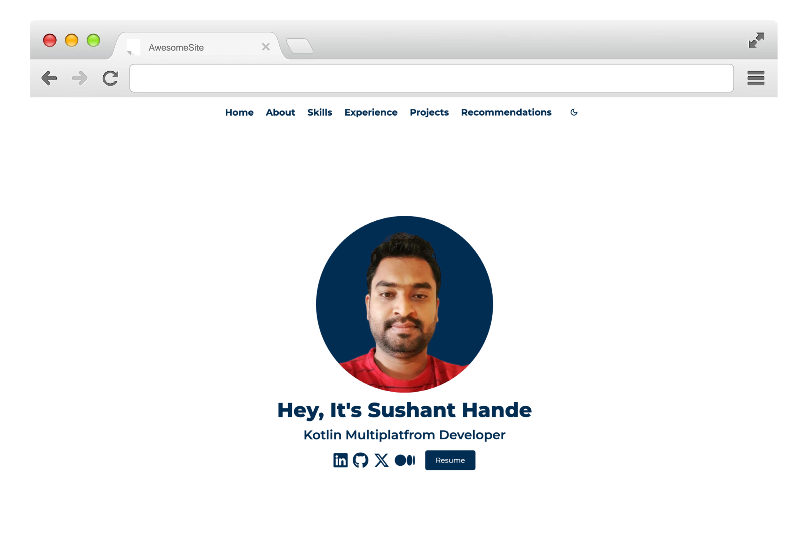
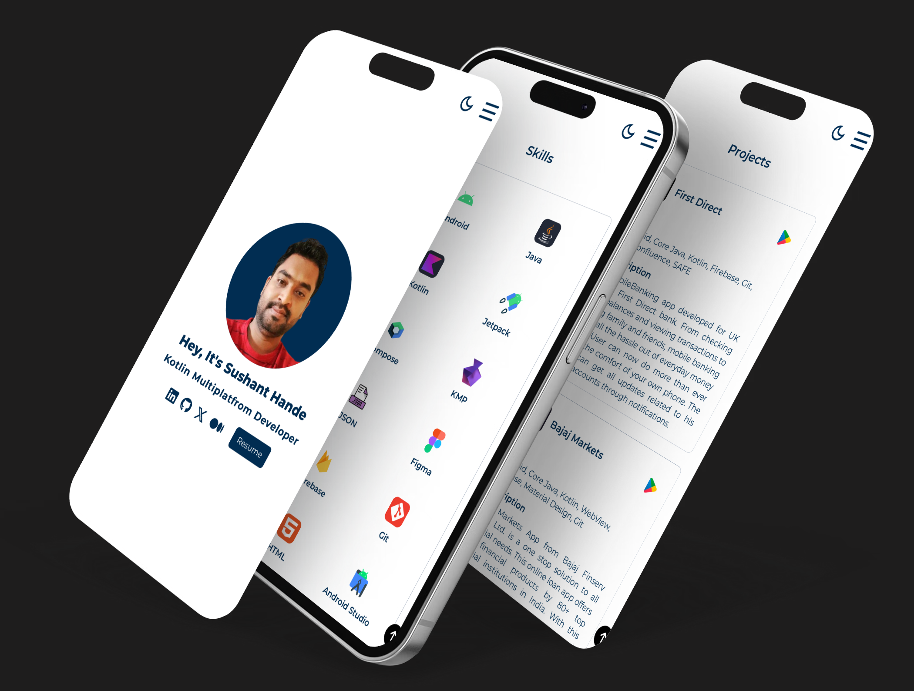

## Sushant Hande's Portfolio


A modern, composable portfolio website built with the Kobweb framework. This repository hosts the source code for my personal portfolio website, showcasing my skills, projects, and experiences.

## [Try it Live]()

  </a>
  </a>
  [](https://hits.sh/github.com/Sushant-Hande/portfolio-kobweb/)


## Features
1. Portfolio Sections - The website includes sections for showcasing my skills, projects, and experiences.
2. Composable UI - The website is built using the Compose HTML library, which allows for a composable and declarative UI.
3. Dark Mode - The website supports dark mode, which can be toggled by the user.
4. Responsive Design - The website is designed to be responsive and work on all devices.


## Technology Stack
1. [Kotlin](https://kotlinlang.org/) - Kotlin is a modern programming language that makes developers happier and more productive.
2. [Compose HTML](https://github.com/JetBrains/compose-multiplatform#:~:text=Libraries-,Compose%20HTML,-Compose%20HTML%20is) - Compose HTML is a library for creating web user interfaces with HTML and CSS.
3. [Kobweb](https://github.com/varabyte/kobweb) - An opinionated Kotlin framework for creating web apps. It is built on top of Compose HTML.


## Mockups

### Desktop


### Mobile



## Getting Started

If you are new to Kobweb framework, please visit Kobweb's [official website](https://kobweb.varabyte.com/docs) and [GitHub repository](https://github.com/varabyte/kobweb/) to learn more about it. 
From the repository, you can learn about setting up the development environment, building the project, and exporting functional website. Currently, official website doesn't contain much information so, most of the things are documented on repository's [readme](https://github.com/varabyte/kobweb/#:~:text=Apache%2D2.0%20license-,K%F0%9F%95%B8%EF%B8%8Fbweb,-Kobweb%20is%20an) file. Once you are done with Kobweb setup, please follow the steps given below to set up this project locally.

**1. Clone the repository:**
```bash
  $ git clone https://github.com/Sushant-Hande/portfolio-kobweb.git
```

**2. Run the development server by typing the following command in a terminal under the `site` folder:**

```bash
  $ cd site
  $ kobweb run
```

**3. Open [http://localhost:8080](http://localhost:8080) with your browser to see the result.**

You can use any editor you want for the project but, it is recommended to use **IntelliJ IDEA Community Edition** which can be downloaded
using the [Toolbox App](https://www.jetbrains.com/toolbox-app/). Press `Q` in the terminal to gracefully stop the server.